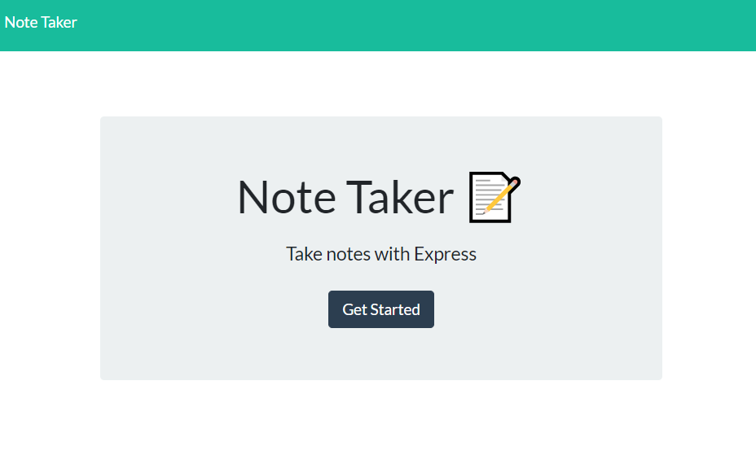

# Note Taker

## Table of Contents

- [Description](#Description)
- [Installation](#Installation)
- [Usage](#Usage)
- [Testing](#Testing)
- [Deployed](#Deployed)
- [Author](#author)
- [Screenshot](#Screenshot)

### Description
Creates a Note Taker that can be used to write and save notes.

User Story
AS A small business owner
I WANT to be able to write and save notes
SO THAT I can organize my thoughts and keep track of tasks I need to complete

### Installation
To install this app. CLone the repository, run npm install wihtin the root directory, this will allow all necessary dependencies from the package.json file.

### Usage
To use this app. You can either follow the deployed heroku link or you can use node server.js and view the application in the localhost:3001 port.

### Testing
No tests were required for this project.

### Deployed
GitHub Repository: https://github.com/garcia2697/-miniature-eureka
Heroku:https://secret-gorge-61248.herokuapp.com/

### Author
Luis Garcia
GitHub: https://github.com/garcia2697

### Screenshot
